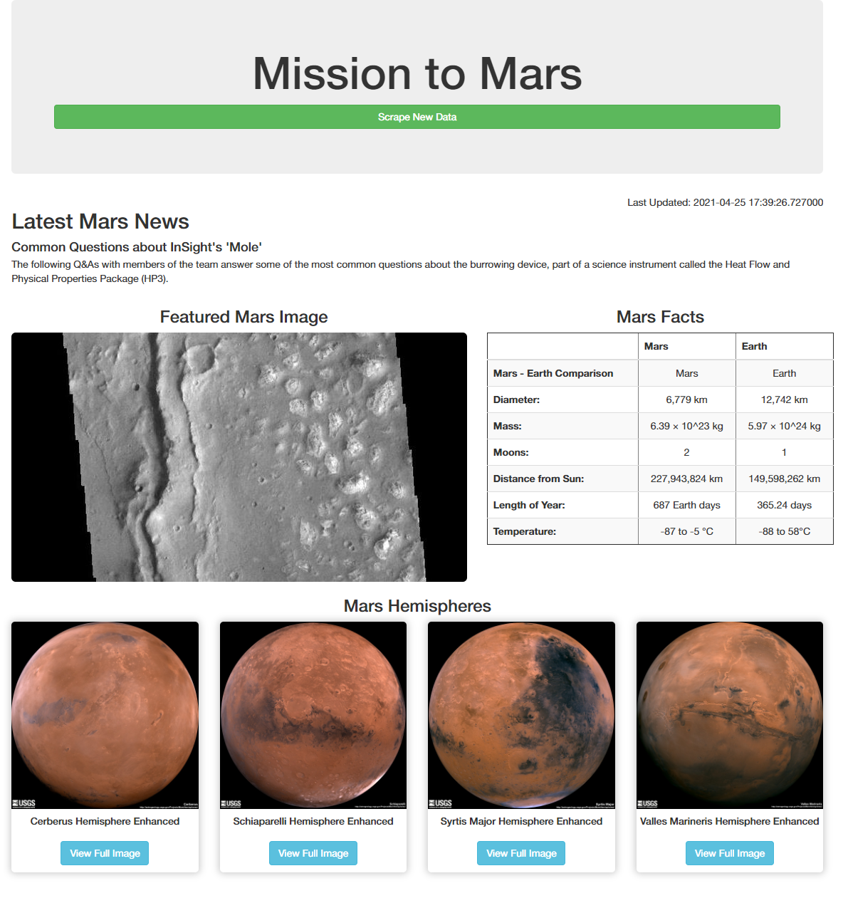
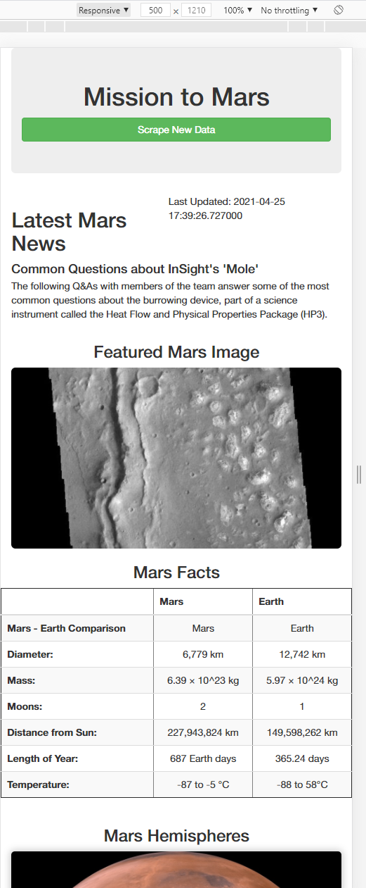

# Challenge - Mission to Mars

## Challenge - Overview

We are tasked with scraping data from a number of given websites that contain information about the planet Mars, and then displaying the gathered data on our own webpage. We scraped for the latest news headline/summary, a picture, and a table of data. For the challenge we needed to scrape another website for four pictures and titles, and include them on our website.

This scraped data would be stored in our local MongoDB, and displayed in a web application built using Flask. We also ran this on our local machine so we could interact with the site and have it automatically scrape the needed data for us.

## Challenge - Scraping Detailed

We tested our scraping abilities using a Jupyter Notebook: [Mission to Mars Notebook](Mission_to_Mars_Challenge.ipynb). Then exported the program as a Python file and cleaned it up by combining the different scrapings into their own functions. This allowed us to import the [scraping](scraping.py) file as a module in our Flask [app](app.py).

The scraping file had one main function that we would call from the Flask app, which then collected all the data from the different websites and functions and returned it organised in a dictionary. In this module we controlled our scraping browser with the Chrome `web_driver`, and passed the browser as an argument into most of our secondary functions to get the data from. We also used Pandas' `.read_html()` function to get a DataFrame of tabled data from another website. Then used Pandas' `df.to_html()` function when returning the data so we could input it in our website.

## Challenge - Flask and MongoDB

Using `PyMongo` and setting up a MongoDB on our local machine we were able to store the data obtained from scraping in a database for continued use. This also allowed us to stop running Flask and the DB at any point and when restarting it the data was still available. We first created the Flask app, and then connected to the MongoDB with the following:

```py
app = Flask(__name__)

app.config["MONGO_URI"] = "mongodb://localhost:27017/mars_app"
mongo = PyMongo(app)
```

Then we located our database (suitably called `mars` in this case) and, while rendering the `index.html` template, we passed in the returned dictionary from running our web scraping program.

```py
mars = mongo.db.mars.find_one()

return render_template("index.html", mars=mars)
```

## Challenge - Bootstrap and HTML/CSS

On our `index.html` template we included a button to allow a user to re-scrape new data from the websites we interacted with. We also ordered the returned data using the Bootstrap framework. The module had us use Bootstrap v3.3 and asked us to organise our scraped data in a presentable way. Below is a screenshot of the site currently, with the MongoDB and Flask app running.



And we endeavoured to make the site responsive too by using the built-in feature of Bootstrap. Below you can see the site on a mobile-sized screen.



## Context

This is the result of Module 10 of the University of Toronto School of Continuing Studies Data Analysis Bootcamp Course - **Python and HTML/CSS** - Web Scraping with HTML/CSS (Flask and MongoDB). Following the guidance of the module we end up pushing this selection of files to GitHub.
